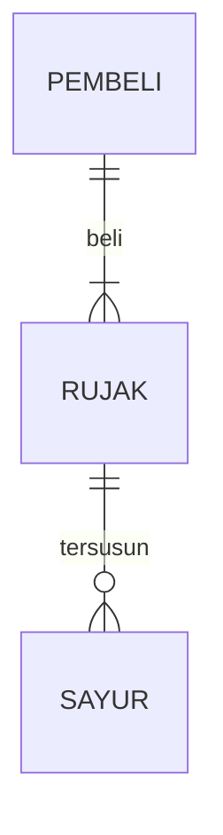

## 1.1 Latar Belakang

Latar belakang pembuatan game ini saya melihat kurangnya ketangakasan dan kefokusan seseorang yang membuat seseorang  tersebut jadi gampang halu,maka dari itu game ini merupakan impelementasi dari ide saya guna memberikan sarana bagi setiap individu/pengguna game yang ingin melatih ketangkasan dan focus diri sendiri.  

## 1.2. Deksripsi Teknologi Informasi
Game ” manuk mabur” adalah game yang saya buat untuk memberikan sarana bagi pengguna untuk dapat melatih ketangkasan dan kefokusan serta mengisi waktu luang.

## 1.3. Branding
Merk: manuk mabur
Tagline:isi lah waktu luangmu untuk main game ini.
Campaign:game yang membuat penggunanya bisa meningkatkan kefokusan dan ketangkasan
Target user
Manusia berusia 8+
Seseorang  yang masih mempunyai tingkat focus minim
Seseorang yang mempunyai waktu luang
Seseorang yang ingin menghibur diri sendiri
User experience theme
Gampang
Mudah 
Sederhana
Warna dominan hijau dan hitam
Inspirasi desain

## 2. User Story

SEBAGAI      SAYA INGIN BISA      SEHINGGA      PRIORITAS
pemain       login                masuk ke game   ⭐⭐⭐⭐
pemain       identitas            mempunyai identitas     ⭐⭐⭐
pemain       bermain              game dapat dimainkan    ⭐⭐⭐⭐⭐
admin        tempat               ada tempat untuk bermain   ⭐⭐⭐
pemain       memainkan dengan sungguh gungguh     menang dalam game     ⭐⭐⭐⭐
## 3. Struktur Data

Cara membuat aneka macam bentuk grafik menggunakan mermaid.js bisa lihat di [https://mermaid.js.org/syntax/entityRelationshipDiagram.html](https://mermaid.js.org/syntax/entityRelationshipDiagram.html) 

## 4. Arsitektur Sistem

Masih pake mermaid.js juga bisa lihat flowchart di [https://mermaid.js.org/syntax/flowchart.html](https://mermaid.js.org/syntax/flowchart.html)

## 5. Teknologi, Library, dan Framework

dalam pembuatan game saya kali ini saya menggunaakan tekhnologi:
1.laptop
2.mouse
3.youtobe
4.sumber sumber
library yang saya gunakan:
1.jFrame = Versi perluasan java.awt.Frame yang menambahkan dukungan untuk arsitektur komponen JFC/Swing.
2.jLabel = Area tampilan untuk string teks pendek atau gambar, atau keduanya.
3.jButton =implementasi dari tombol "tekan".

framework yang saya gunakan:
1.Pixi.js in action
2.visualcode
dll

## 6. Desain User Experience dan User Interface

Bisa load image 

## 7. Demonstrasi Video

Link youtube nya

## 8. Bagaimana mesin komputasi dan sistem operasi berperan dalam produk teknologi informasimu ?

Link youtube nya di detik jawaban ini

## 9. Bagaimana algoritma, struktur data, dan bahasa pemrograman berperan dalam produk teknologi informasimu ?

Link youtube nya di detik jawaban ini

## 10. Bagaimana metode pengembangan perangkat lunak / Software Development Life Cycle berperan dalam produk teknologi informasimu ?

Link youtube nya di detik jawaban ini

## 11. Bagaimana database / sistem basis data berperan dalam produk teknologi informasimu ?

Link youtube nya di detik jawaban ini
